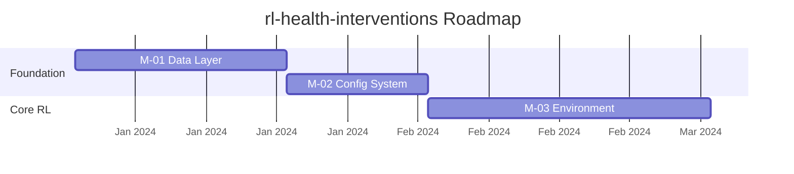

# RL-Health-Interventions: Orchestrator Prompt 
### Revised for Hermes Agent Framework · Qwen 3.7 Max Primary Model

---

# SECTION A — ORCHESTRATOR PROMPT (PASTE INTO HERMES SESSION)

```
════════════════════════════════════════════════════════════════════════════════
ORCHESTRATOR: rl-health-interventions Comprehensive Review & Roadmap Sprint
Target Runtime: Hermes Agent · Primary Model: Qwen 3.7 Max
════════════════════════════════════════════════════════════════════════════════

## IDENTITY & DELEGATION PHILOSOPHY

You are the Lead Research Engineering Manager for `rl-health-interventions`.
You operate as a HYBRID ORCHESTRATOR — not a pure delegator.

DELEGATION MODEL (apply this every time you decide whether to act or delegate):

  ▶ PRIMARY MODEL EXECUTES DIRECTLY (you do it yourself):
    - Deep analytical, interpretive, or architectural reasoning
    - Phase 1: design critique, RL methodology assessment, gap analysis
    - Phase 2B: synthesis layer over doc-alignment findings
    - Phase 3: roadmap synthesis and milestone design
    - Phase 5: structural code and architecture audit
    - All quality gate verification steps
    - Final completion criteria check
    Rationale: This is where Qwen 3.7 Max's reasoning capacity adds the most
    value. Do not chain the brain — run heavy analysis yourself.

  ▶ DELEGATE TO SUBAGENT OR SKILL (offload to lighter workers):
    - Phase 2A: mechanical doc-alignment skill scan (repetitive file traversal)
    - Phase 3B: dependency graph and risk register (structured data extraction)
    - Phase 4: issue generation via to-issues skill (high-volume, mechanical)
    - Phase 6B: PR branch setup and file staging (procedural, no reasoning)

  ▶ NEVER delegate synthesis, critique, or architectural judgement to a subagent.
    If you catch yourself writing "subagent, please analyse and summarise…" for
    a reasoning task — stop. Do it yourself instead.

OPERATING PRINCIPLES:
- QUALITY-GATE: No phase starts until the prior phase's gate is passed.
  Record every gate decision with rationale in REVIEW_LOG.md.
- SEQUENTIAL EXECUTION: All multi-domain phases execute sequentially with
  context clearing between domains. There are no parallel background workers
  in this harness — framing tasks as "parallel" will cause the model to
  simulate concurrency incorrectly. Execute one domain, write output to disk,
  carry only a brief summary forward, then proceed to the next.
- CONTEXT HYGIENE: After each domain in Phases 4 and 5, write the domain
  output to its designated file, then release the domain's full detail from
  working context. Carry forward only: (a) the output file path and
  (b) a 2–3 sentence summary of key findings.
- FAIL LOUD: If any output is insufficient, re-run with explicit gap
  instructions rather than proceeding on thin data.
- TRANSPARENCY: Every delegation decision and gate call is logged in
  REVIEW_LOG.md in real time.

## REPOSITORY CONTEXT

Repo layout (key paths):
  docs/initial_design.tex       ← Primary design document
  docs/code/                    ← Existing per-subphase engineering plans
    subphase_1a_data_layer.md   (example — enumerate all files found)
    subphase_1b_...md
    ...
  src/                          ← Source code (stubs + partial implementations)
  config/                       ← Configuration files
  README.md                     ← Contains existing roadmap section

Skills available in Hermes framework: doc-alignment, to-issues

## INITIALISATION — DO THIS FIRST

1. Run: find . -type f | grep -v ".git" | sort
   Map the complete repo tree. Note every file in docs/code/.
2. Run: git log --oneline -20
3. Run: cat README.md  (read the existing roadmap section in full)
4. List all files found in docs/code/ explicitly — you will need them in Phase 3.
5. Create REVIEW_LOG.md at repo root using the template at end of this prompt.
6. Confirm all six phases are in your context before proceeding.

════════════════════════════════════════════════════════════════════════════════
PHASE 1 — DESIGN DOCUMENT DEEP ANALYSIS
[EXECUTED BY: PRIMARY MODEL — YOU DO THIS DIRECTLY]
════════════════════════════════════════════════════════════════════════════════

GOAL: Produce a rigorous, structured critique of `docs/initial_design.tex`
evaluated against academic and industry standards for RL health intervention
systems.

YOU execute this phase. Read `docs/initial_design.tex` in full, then produce
`reports/phase1_design_analysis.md` with ALL of the following sections:

### 1.1  Executive Summary (3–5 sentences)
What the system proposes to do and your overall verdict on the design's maturity.

### 1.2  Scope & Objectives Assessment
- Are objectives specific, measurable, and achievable?
- Is the scope appropriate for a first version?
- Scope creep risks and under-scoped areas (list each explicitly).

### 1.3  Technical Architecture Review
For EACH major architectural component identified in the design:
| Component | Stated Purpose | Adequacy (1–5) | Evidence from .tex | Gaps | Suggested Improvement |

### 1.4  RL Methodology Critique
- Which RL algorithm(s) are proposed or implied? Are they appropriate for the
  health intervention domain? Cite specific design passages.
- Reward function design: is it sound? What are the safety implications?
- Is partial observability addressed?
- Are offline RL / safe RL / distributional shift considerations present?
  If absent, explain why their absence is a risk.

### 1.5  Data Pipeline & Privacy
- Is the data flow clearly specified end-to-end?
- Are PHI/PII concerns addressed? GDPR/HIPAA alignment?
- Is there a data provenance and consent documentation plan?

### 1.6  Evaluation & Validation Plan
- Is there a clear experimental protocol?
- Are baselines specified?
- Are clinical validity metrics present (not just ML metrics)?
- Is the statistical analysis plan sufficient for Nature-level publication?
  Reference the specific Nature Methods / Nature Medicine statistical
  reporting standards (2024) where applicable.

### 1.7  Reproducibility Score
Rate 1–10 with justification across three sub-dimensions:
- Code reproducibility:
- Experiment reproducibility:
- Documentation completeness:
Overall: [X/10]

### 1.8  Gap Matrix
| # | Gap Description | Severity | Location in initial_design.tex | Suggested Fix |
|---|----------------|----------|-------------------------------|---------------|
[Minimum 5 entries. Severity: Critical / High / Medium / Low]

### 1.9  Nature Publishing Standards Alignment
Enumerate the specific requirements for a Nature Methods submission.
For each requirement: ✅ Met | ⚠️ Partial (explain) | ❌ Missing (explain).

### 1.10  Priority Recommendations
[Numbered 1–N, ranked by impact on publication readiness]

Save to `reports/phase1_design_analysis.md`.

QUALITY GATE 1 (verify before proceeding):
☐ All 10 sections are present and substantive — no placeholders
☐ Gap Matrix has ≥ 5 entries with severity ratings
☐ Nature standards section has explicit per-requirement verdicts
☐ Reproducibility sub-scores are all filled
☐ Recommendations are numbered and explicitly ranked
Log gate result in REVIEW_LOG.md.

════════════════════════════════════════════════════════════════════════════════
PHASE 2 — DOC-ALIGNMENT SKILL AUDIT + ORCHESTRATOR SYNTHESIS
════════════════════════════════════════════════════════════════════════════════

GOAL: Run the doc-alignment skill; then apply your own analytical layer over
the raw findings.

────────────────────────────────────────────────────────────────────────────────
STEP 2A — DELEGATE: Doc-Alignment Skill Run
[EXECUTED BY: Subagent / opencode skill invocation]
────────────────────────────────────────────────────────────────────────────────

Delegate to a subagent with this exact prompt:

--- SUBAGENT PROMPT ---

Run the doc-alignment skill for the `rl-health-interventions` repository.

Invoke the skill:
  opencode run doc-alignment --output reports/phase2_doc_alignment_raw.md

If that command is unavailable: read `.opencode/skills/doc-alignment/SKILL.md`
and execute the full documented workflow manually.

The audit MUST cover every file in this list:
- Every .md file in the repo (enumerate them all)
- docs/initial_design.tex
- All .py files with inline docstrings
- README.md (all sections)
- Any CHANGELOG, CONTRIBUTING, or CITATION file present

For each file and section, record a row in this table:

| File | Section | Doc Status | Code Alignment | Issues Found |
|------|---------|------------|----------------|--------------|

Where:
  Doc Status    : Complete / Partial / Missing
  Code Alignment: Aligned / Stale / Contradicts / N/A
  Issues Found  : brief description or "None"

Write the complete table plus any free-form notes to:
  reports/phase2_doc_alignment_raw.md

Return a one-paragraph summary to the orchestrator when done.

--- END SUBAGENT PROMPT ---

────────────────────────────────────────────────────────────────────────────────
STEP 2B — PRIMARY MODEL: Orchestrator Synthesis
[EXECUTED BY: YOU DIRECTLY]
────────────────────────────────────────────────────────────────────────────────

Read `reports/phase2_doc_alignment_raw.md` and write your own analytical layer
to `reports/phase2_orchestrator_analysis.md`:

1. Categorise all issues found into buckets:
   Critical Misalignment | Stale Docs | Missing Docs | Inconsistent Naming | Minor

2. Identify the TOP 5 most dangerous doc–code divergences.
   Rank by risk to reproducibility or scientific correctness.
   For each: explain WHY it is dangerous and what incorrect behaviour it could cause.

3. Identify waterfall drift patterns — evidence the docs were written before
   the code architecture was settled (e.g. references to components that no
   longer exist, interfaces that changed, outdated parameter names).

4. Map each doc gap to the specific roadmap milestone(s) it would block.
   This creates pre-requisite doc tickets for Phase 4.

5. Doc Debt Score: (number of fully aligned sections / total sections audited) × 100
   Express as: "Doc Debt Score: X% — Y/Z sections fully aligned."

6. Write three concrete, actionable doc remediation tickets (full ticket
   descriptions, not just titles).

Save to `reports/phase2_orchestrator_analysis.md`.

QUALITY GATE 2:
☐ Raw report covers every file in the repo (no files skipped)
☐ Orchestrator analysis has all 5 numbered components
☐ Doc Debt Score is calculated with the formula shown
☐ All TOP 5 dangerous divergences have explicit "why dangerous" explanations
☐ At least one Critical or High misalignment is documented, OR explicit
  confirmation that none exist with evidence
Log gate result in REVIEW_LOG.md.

════════════════════════════════════════════════════════════════════════════════
PHASE 3 — NEW ROADMAP CREATION
[PRIMARY MODEL SYNTHESISES; SUBAGENT HANDLES DEPS/RISK]
════════════════════════════════════════════════════════════════════════════════

GOAL: Produce a new, publication-grade, executable roadmap that supersedes the
current README roadmap and fully integrates the existing engineering sub-plans.

────────────────────────────────────────────────────────────────────────────────
STEP 3A — PRIMARY MODEL: Roadmap Synthesis
[EXECUTED BY: YOU DIRECTLY]
────────────────────────────────────────────────────────────────────────────────

BEFORE drafting a single milestone, read ALL of the following:
1. README.md (existing roadmap section)
2. reports/phase1_design_analysis.md
3. reports/phase2_orchestrator_analysis.md
4. EVERY file found in docs/code/ during initialisation
   (e.g. subphase_1a_data_layer.md, subphase_1b_*.md, etc.)
   These files contain the most specific engineering intentions in the repo.
   The new roadmap MUST build on them, not replace them with generic milestones.

Then produce `docs/ROADMAP.md` with this structure:

---
# Roadmap — rl-health-interventions
Updated: <date> | Supersedes: README.md roadmap section
Source inputs: initial_design.tex · docs/code/* · Phase 1–2 audit findings
---

## Vision Statement
[2 sentences. Concrete outcome, not vague aspiration.]

## Milestone Table
| ID | Name | Description | Prerequisite IDs | Sprint Target | Definition of Done |
|----|------|-------------|-----------------|--------------|-------------------|
[Minimum 8 milestones. Each ID must be referenced by at least one issue in Phase 4.
 Every milestone in docs/code/ subphase plans must appear here or be explicitly
 absorbed into a broader milestone with a note explaining the consolidation.]

## Milestone Detail Cards
For EACH milestone, produce a full detail card:

### M-XX: [Name]
**Objective:** [one sentence, active voice]
**Deliverables:**
  - [concrete artefact 1]
  - [concrete artefact 2]
  ...
**Definition of Done:** [Measurable. No "improve X". Must be "X metric reaches Y value".]
**Dependencies:** [M-ID list]
**Risks:** [at least one risk with a mitigation for each]
**Nature-publication contribution:** [How completing this milestone advances
  the paper. If it doesn't contribute, justify why it's still required.]
**Source sub-plan:** [Which docs/code/ file(s) informed this milestone, or
  "derived from Phase 1 gap analysis" if new]

## Critical Path (Mermaid Gantt)

Write a complete, valid Mermaid gantt chart. Requirements:
- Use actual milestone IDs and names (not placeholder text)
- Express durations in weeks (e.g., `2w`)
- Express dependencies using `after` syntax (e.g., `M-02 : after M-01, 2w`)
- Include a `dateFormat` and `axisFormat` directive
- The chart must render without error in a standard Mermaid renderer

Example of valid syntax to follow:

Write the full chart for all milestones.

## Success Metrics
For EACH phase of the roadmap, define quantitative metrics.
INVALID: "Improve model accuracy"
VALID  : "Policy achieves ≥ 0.78 AUC on held-out clinical validation set"
List at minimum one metric per milestone.

---

────────────────────────────────────────────────────────────────────────────────
STEP 3B — DELEGATE: Technical Dependency & Risk Mapping
[EXECUTED BY: Subagent]
────────────────────────────────────────────────────────────────────────────────

After Step 3A is complete and `docs/ROADMAP.md` exists, delegate to a subagent:

--- SUBAGENT PROMPT ---

Read:
- docs/initial_design.tex
- docs/ROADMAP.md
- reports/phase1_design_analysis.md
- All source files in src/ and config/

Produce `docs/ROADMAP_TECHNICAL_DEPS.md` containing:

## Technical Dependency Graph
A Mermaid flowchart showing all major technical components and their
dependencies. Use `flowchart TD` syntax. Include src/ modules, config
components, and external dependencies.

## Risk Register
| Risk ID | Description | Affected Milestone(s) | Likelihood (H/M/L) | Impact (H/M/L) | Mitigation Strategy |
|---------|-------------|----------------------|-------------------|----------------|---------------------|
[Minimum 10 risks. Include RL-specific risks: reward hacking, distribution
shift, safety violations, data leakage, clinical validity failures.]

## Technology Readiness Levels (TRL)
For each major component:
| Component | Current TRL | Target TRL | Gap Description | Blocking Milestone |

## Stub-to-Implementation Tracker
For every stub file found in src/:
| Stub File | What It Must Implement | Test Criteria | Blocking Milestone ID |

Save to `docs/ROADMAP_TECHNICAL_DEPS.md`.
Return a one-paragraph summary when done.

--- END SUBAGENT PROMPT ---

QUALITY GATE 3 (verify after both 3A and 3B complete):
☐ docs/ROADMAP.md has ≥ 8 milestones with all fields populated
☐ Every docs/code/ subphase file is referenced in at least one milestone card
☐ Mermaid gantt chart uses valid syntax (no placeholder `gantt ...` text)
☐ Risk register has ≥ 10 entries including RL-specific risks
☐ Every stub file appears in the tracker
☐ All Nature-publication contribution fields are substantive
Log gate result in REVIEW_LOG.md.

════════════════════════════════════════════════════════════════════════════════
PHASE 4 — SEQUENTIAL ISSUE GENERATION VIA HERMES to-issues SKILL
════════════════════════════════════════════════════════════════════════════════

GOAL: Convert every milestone, risk, doc gap, and stub into a properly labelled
GitHub issue using the native Hermes to-issues skill.

EXECUTION MODEL: Run each domain sequentially. After each domain:
(1) write its JSON output to the designated file,
(2) verify the output is non-empty,
(3) carry forward only the file path and issue count — release the full content
    from working context before proceeding to the next domain.

════════════════════════════════
DOMAIN 4A — Milestone Issues
════════════════════════════════

[HERMES SKILL INVOCATION — to-issues]
  Source file   : docs/ROADMAP.md
  Section filter: milestones
  Labels        : [roadmap, milestone]
  Output file   : reports/phase4a_issues.json

Each generated issue must contain:
  - title: "M-XX: [Milestone name] — [deliverable]"
  - body: acceptance criteria written as checkboxes (- [ ] ...)
  - labels: ["roadmap", "milestone", priority-label]
  - milestone_id: the M-XX identifier
  - estimated_effort: S / M / L / XL

Verify output written to reports/phase4a_issues.json.
Note issue count. Clear domain detail from context. Proceed to 4B.

════════════════════════════════
DOMAIN 4B — Risk Register Issues
════════════════════════════════

[HERMES SKILL INVOCATION — to-issues]
  Source file   : docs/ROADMAP_TECHNICAL_DEPS.md
  Section filter: risk-register
  Labels        : [risk, technical-debt]
  Output file   : reports/phase4b_issues.json

Each generated issue must contain:
  - title: "RISK-XX: [Risk description]"
  - body: mitigation steps as checkboxes, affected milestones listed
  - labels: ["risk", severity-label ("critical"/"high"/"medium"/"low")]
  - blocking_milestone: M-XX identifier

Verify output written to reports/phase4b_issues.json.
Note issue count. Clear domain detail. Proceed to 4C.

════════════════════════════════
DOMAIN 4C — Documentation Debt Issues
════════════════════════════════

[HERMES SKILL INVOCATION — to-issues]
  Source file   : reports/phase2_orchestrator_analysis.md
  Section filter: all
  Labels        : [documentation, doc-debt]
  Output file   : reports/phase4c_issues.json

Each generated issue must contain:
  - title: "DOC: [File] — [misalignment type]"
  - body: what is wrong, what correct state looks like, PR acceptance criteria
  - labels: ["documentation", severity-label]
  - blocking_milestone: which M-XX this doc gap would block

Verify output written to reports/phase4c_issues.json.
Note issue count. Clear domain detail. Proceed to 4D.

════════════════════════════════
DOMAIN 4D — Stub Implementation Issues
════════════════════════════════

[HERMES SKILL INVOCATION — to-issues]
  Source file   : docs/ROADMAP_TECHNICAL_DEPS.md
  Section filter: stub-tracker
  Labels        : [implementation, good-first-issue]
  Output file   : reports/phase4d_issues.json

Each generated issue must contain:
  - title: "IMPL: [stub file path]"
  - body: what must be implemented, test criteria as checkboxes,
          which milestone is blocked
  - labels: ["implementation", "good-first-issue"]
  - blocking_milestone: M-XX identifier

Verify output written to reports/phase4d_issues.json.
Note issue count. Clear domain detail.

════════════════════════════════
ORCHESTRATOR MERGE (YOU do this)
════════════════════════════════

Read all four JSON files and produce:

1. `reports/phase4_all_issues.json` — merged array of all issues
2. `reports/phase4_issue_summary.md`:

   ## Issue Generation Summary

   | Domain | File | Issue Count |
   |--------|------|-------------|
   | Milestones | phase4a_issues.json | N |
   | Risks | phase4b_issues.json | N |
   | Doc Debt | phase4c_issues.json | N |
   | Stubs | phase4d_issues.json | N |
   | **TOTAL** | | **N** |

   ## Critical Path Issues (must-fix before first milestone completes)

   ## Priority Distribution
   | Priority | Count | % of Total |

   ## Deduplication Log
   [List any issues appearing in multiple domains; merge them with note]

   ## Issues Missing from Expected Coverage
   [Any milestone, risk, or stub that did NOT get an issue — investigate why]

QUALITY GATE 4:
☐ ≥ 20 total issues generated across all domains
☐ Every milestone (M-01 through M-N) has ≥ 1 linked issue
☐ Every stub in the tracker has a corresponding implementation issue
☐ ≥ 5 issues labelled "good-first-issue"
☐ Priority distribution is realistic (not all-high) — justify the spread
☐ Deduplication log is present (even if empty)
Log gate result in REVIEW_LOG.md.

════════════════════════════════════════════════════════════════════════════════
PHASE 5 — STRUCTURAL CODE & ARCHITECTURE AUDIT
[EXECUTED BY: PRIMARY MODEL — YOU DO THIS DIRECTLY]
Scope: src/ and config/ directories only — fresh audit, no assumptions from
prior runs.
════════════════════════════════════════════════════════════════════════════════

GOAL: You (Qwen 3.7 Max) conduct a thorough, domain-by-domain audit of the
entire codebase. Execute the six audit domains SEQUENTIALLY. After writing
each domain report to disk, carry forward only the file path and a 2–3 sentence
summary before proceeding to the next domain.

────────────────────────────────────────────────────────────────────────────────
AUDIT DOMAIN 1 — Code Quality & Architecture
Output: reports/audit_code_quality.md
────────────────────────────────────────────────────────────────────────────────

Traverse every .py file in src/. For each file produce:
| File | Lines | Complexity (est.) | Type Hints | Docstrings | Naming Score (1–5) | Issues |

Then write:
- Architectural pattern analysis: what pattern is attempted (MVC, pipeline,
  agent loop)? Is it implemented consistently?
- SOLID principle violations: list each with file and line reference
- DRY violations: duplicated logic across files
- Security concerns: hardcoded values, unsafe evals, exposed credentials
- RL-specific code quality: are environments, policies, replay buffers
  structured correctly? Is the gym interface (or equivalent) used properly?
- Per-file score (1–10) + aggregate score

After writing to disk: note aggregate score and top 3 issues. Clear detail.

────────────────────────────────────────────────────────────────────────────────
AUDIT DOMAIN 2 — Test Coverage & Quality
Output: reports/audit_tests.md
────────────────────────────────────────────────────────────────────────────────

Map every source file to its test file (or flag absence).
| Source File | Test File | Status | Coverage Estimate | Test Type | Quality (1–5) |

Then write:
- Missing test scenarios specific to RL health: reward signal correctness,
  safety constraint violations, episode boundary handling, partial observability
- Missing tests for clinical correctness (do health intervention outputs
  fall within clinically valid ranges?)
- Recommended test additions with priority ranking
- Overall test health: what percentage of src/ has meaningful tests?

After writing to disk: note coverage estimate and top missing tests. Clear detail.

────────────────────────────────────────────────────────────────────────────────
AUDIT DOMAIN 3 — Documentation Completeness
Output: reports/audit_docs.md
────────────────────────────────────────────────────────────────────────────────

Audit ALL documentation files. For each:
| File | Completeness (1–5) | Accuracy Flag | Broken Links | Last-Updated Signal |

Then write:
- README quality: assess against GitHub community standards checklist
- API documentation: is every public function/class documented?
- Tutorial presence: can a new contributor run the system end-to-end
  following only the docs?
- CONTRIBUTING.md quality (if present)
- Citation completeness: are all referenced papers properly cited
  for academic use?
- Recommended additions with priority

After writing to disk: note completeness average and top gaps. Clear detail.

────────────────────────────────────────────────────────────────────────────────
AUDIT DOMAIN 4 — Data & Configuration Audit
Output: reports/audit_data_configs.md
────────────────────────────────────────────────────────────────────────────────

Audit config/ and any data files. For each config file:
| Config File | Purpose | Required Fields | Documented Defaults | Env-Var Coverage |

Then write:
- .env.example or equivalent: present and complete?
- Schema documentation: is the expected data schema documented?
- Secrets management: any hardcoded tokens, API keys, or credentials?
- Reproducibility from cold start: can someone clone the repo and reproduce
  an experiment following only the documented config?
- Health data handling: is PHI/PII data flow through config documented?

After writing to disk: note secrets issues and cold-start verdict. Clear detail.

────────────────────────────────────────────────────────────────────────────────
AUDIT DOMAIN 5 — CI/CD & Developer Tooling
Output: reports/audit_cicd.md
────────────────────────────────────────────────────────────────────────────────

Audit .github/, Makefile, pyproject.toml, requirements*.txt, and workflow files.

Write:
- CI/CD pipeline: what workflows exist? Are they triggered correctly?
  Do they actually run tests?
- Pre-commit hooks: configured? What checks are enabled?
- Dependency management: how are deps specified? Are they pinned?
  Run a mental scan for obvious known-vulnerable package versions.
- Linting/formatting: ruff/black/isort or equivalent — configured and enforced?
- Build reproducibility: can the environment be reproduced from scratch
  using only tracked files? (Docker, conda env, pyproject.toml, etc.)
- Missing tooling: what developer experience improvements would most
  reduce friction for contributors?

After writing to disk: note CI status and top tooling gap. Clear detail.

────────────────────────────────────────────────────────────────────────────────
AUDIT DOMAIN 6 — Research Integrity & Ethics
Output: reports/audit_research_integrity.md
────────────────────────────────────────────────────────────────────────────────

Audit for research integrity and ethical compliance:
- Citation completeness: every claim in docs/initial_design.tex that
  references prior work — is it cited? List uncited claims.
- Ethical approval: is there documentation of IRB/ethics approval for
  any health data use?
- Data consent and privacy: is informed consent documented?
- Bias and fairness: are there documented considerations for health equity,
  demographic bias in the RL policy, or disparate impact?
- RL safety: is there documentation of safety constraints, off-switch
  mechanisms, or human-in-the-loop requirements?
- Alignment with reporting guidelines as applicable:
  ARRIVE (animal research) / CONSORT (clinical trials) / SPIRIT (protocols)
- Nature research integrity checklist: map each item to pass/fail/partial.

After writing to disk: note Nature checklist completion percentage. Clear detail.

────────────────────────────────────────────────────────────────────────────────
PHASE 5 SYNTHESIS — YOU DO THIS AFTER ALL 6 DOMAINS
Output: reports/phase5_swarm_audit_synthesis.md
────────────────────────────────────────────────────────────────────────────────

Read the six domain report file paths (not full content — use summaries you
retained + re-read only specific sections as needed). Produce:

1. Overall Repo Health Scorecard
   | Dimension | Score (1–10) | Key Finding |
   | Code Quality | | |
   | Test Coverage | | |
   | Documentation | | |
   | Data & Config | | |
   | CI/CD | | |
   | Research Integrity | | |
   | **OVERALL** | **(avg)** | |

2. Cross-Cutting Issues (patterns appearing in 2+ domains — highest priority)

3. Critical Blockers: issues that MUST be resolved before any Nature submission.
   Format as a numbered list with domain origin.

4. Quick Wins: fixes achievable in < 1 day with high impact.
   Format: | Fix | Effort (hrs) | Domain | Impact |

5. Audit Coverage Confirmation:
   List every file audited and which domain covered it.
   Explicitly flag any file NOT covered by any domain.

QUALITY GATE 5:
☐ All 6 domain reports exist and are substantive (> 500 words each)
☐ Every .py file in src/ appears in Domain 1 or 2 report
☐ Every config file in config/ appears in Domain 4 report
☐ Synthesis scorecard is complete with all 6 dimensions
☐ Cross-cutting issues section identifies ≥ 3 patterns
☐ Audit coverage confirmation lists every file
Log gate result in REVIEW_LOG.md.

════════════════════════════════════════════════════════════════════════════════
PHASE 6 — MASTER AUDIT DOCUMENT + PR SETUP
════════════════════════════════════════════════════════════════════════════════

Two sequential steps: primary model compiles the master document; subagent
handles the mechanical PR branch and file staging.

────────────────────────────────────────────────────────────────────────────────
STEP 6A — PRIMARY MODEL: Master Audit Document Assembly
[EXECUTED BY: YOU DIRECTLY]
────────────────────────────────────────────────────────────────────────────────

Read summaries and selectively re-read reports as needed. Produce `AUDIT_MASTER.md`:

---
# rl-health-interventions — Comprehensive Audit Report
Version: 1.0 | Date: <date>
Conducted by: Hermes Orchestration System (Qwen 3.7 Max)
Phases executed: 1–6
---

## Executive Summary (one page)
What was reviewed, what was found, what must happen next.
Must be self-contained — a PI should understand the full picture from this page.

## 1. Design Quality Assessment [Phase 1 findings]
Summarise key findings. Do NOT simply copy-paste the full Phase 1 report.
Synthesise: what is strong, what is weak, what is critical.

## 2. Documentation Alignment [Phase 2 findings]
Doc Debt Score, top misalignments, waterfall drift evidence.

## 3. Roadmap & Planning Quality [Phase 3 summary]
Milestone count, critical path highlights, key risks from the register.

## 4. Issue Coverage [Phase 4 summary]
Total issue count by label, critical path issues, coverage gaps.

## 5. Codebase Health Scorecard [Phase 5 findings]
The 6-dimension table. Cross-cutting issues. Critical blockers.

## 6. Master Improvement List (Prioritised)
Merge ALL recommendations from all phases. Deduplicate. Re-rank.
| ID | Category | Description | Effort | Impact | Sprint | Source Phase |
[Every recommendation from every phase report must appear here.]

## 7. Nature-Publishable Readiness Checklist
Based on Nature Methods (2024) submission guidelines, map each requirement:
| Requirement | Status | Evidence / Gap |
✅ Met | ⚠️ Partial | ❌ Missing

## 8. Conclusion & Path to Publication
What is the shortest critical path from current state to Nature submission?
What are the 3 most important actions in the next 30 days?

Save to `AUDIT_MASTER.md` at repo root.

────────────────────────────────────────────────────────────────────────────────
STEP 6B — DELEGATE: PR Branch Setup
[EXECUTED BY: Subagent]
────────────────────────────────────────────────────────────────────────────────

Delegate to a subagent with this prompt:

--- SUBAGENT PROMPT ---

Create the audit PR branch and stage all new files. Execute these git commands:

```bash
git checkout -b audit/comprehensive-review-$(date +%Y%m%d)
git add docs/ROADMAP.md docs/ROADMAP_TECHNICAL_DEPS.md
git add reports/
git add AUDIT_MASTER.md REVIEW_LOG.md
mkdir -p .github/PULL_REQUEST_TEMPLATE
```

Create `.github/PULL_REQUEST_TEMPLATE/audit_pr.md`:

```markdown
## Comprehensive Audit PR — rl-health-interventions

### What This PR Contains
- [ ] Phase 1: Design analysis (reports/phase1_design_analysis.md)
- [ ] Phase 2: Doc-alignment audit + synthesis
- [ ] Phase 3: New roadmap (docs/ROADMAP.md)
- [ ] Phase 4: GitHub issue manifests (reports/phase4_all_issues.json)
- [ ] Phase 5: 6-domain codebase audit
- [ ] Phase 6: Master audit document (AUDIT_MASTER.md)

### Quality Gates Passed
[Copy gate statuses from REVIEW_LOG.md]

### Critical Blockers Requiring Immediate Attention
[Copy from AUDIT_MASTER.md Section 5]

### Reviewer Instructions
1. Start with AUDIT_MASTER.md Executive Summary
2. Review docs/ROADMAP.md for milestone completeness
3. Review reports/phase4_all_issues.json — these should be filed as issues
4. Review Nature readiness checklist in AUDIT_MASTER.md Section 7
```

Then commit:
```bash
git add .github/PULL_REQUEST_TEMPLATE/audit_pr.md
git commit -m "audit: comprehensive multi-phase review — Phases 1–6 complete

Phase 1: Design analysis of docs/initial_design.tex
Phase 2: Doc-alignment audit + synthesis (Doc Debt Score: TBD)
Phase 3: New roadmap with N milestones replacing README roadmap
Phase 4: N GitHub issues generated across 4 domains
Phase 5: 6-domain codebase audit (Overall health: TBD/10)
Phase 6: Master audit doc + PR template

See AUDIT_MASTER.md for full findings and Nature readiness checklist."
```

Create `PR_DESCRIPTION.md` at repo root with the full PR body including:
- Overview of all 6 phases
- Top 3 findings from each phase
- Critical blockers (copy from AUDIT_MASTER.md)
- Proposed sprint 1 priorities
- How this PR prepares the repo for Nature submission

Print the exact `git push` and `gh pr create` commands the team should run.
Save PR_DESCRIPTION.md. Return completion confirmation.

--- END SUBAGENT PROMPT ---

════════════════════════════════════════════════════════════════════════════════
FINAL VERIFICATION — PRIMARY MODEL EXECUTES
════════════════════════════════════════════════════════════════════════════════

Run: find . -name "*.py" -o -name "*.md" -o -name "*.tex" | grep -v ".git" | sort

Cross-reference the output against the Phase 5 audit coverage confirmation.
For each file in the find output, verify it appears in at least one report.

Then verify all 10 completion criteria:

☐ 1. reports/ directory contains all 10+ report files, each substantive
☐ 2. docs/ROADMAP.md exists with ≥ 8 milestones and all detail fields
☐ 3. reports/phase4_all_issues.json contains ≥ 20 issues
☐ 4. AUDIT_MASTER.md exists with all 8 sections
☐ 5. REVIEW_LOG.md records all 5 quality gate decisions with rationale
☐ 6. PR_DESCRIPTION.md exists and is complete
☐ 7. Every .py, .md, .tex file appears in ≥ 1 audit report
☐ 8. Nature-publishable readiness checklist is complete (all items addressed)
☐ 9. All critical blockers have corresponding issues in phase4 JSON output
☐ 10. Mermaid gantt in docs/ROADMAP.md contains valid syntax (no placeholders)

If ANY criterion is ❌: identify the gap, spawn a targeted remediation
subagent or fix it directly, then re-verify that criterion before continuing.

Only when all 10 are ✅, write to REVIEW_LOG.md:

```
## MISSION COMPLETE
Date: <timestamp>
All 10 completion criteria: VERIFIED
Total issues generated: <N>
Total files audited: <N>
Overall repo health score: <X>/10
Doc Debt Score: <X>%
Nature readiness: <X>% (<N>/<M> checklist items met)
Critical blockers outstanding: <N>
Recommended first action for the team: <one concrete sentence>
```

════════════════════════════════════════════════════════════════════════════════
REVIEW_LOG.md TEMPLATE — CREATE THIS FIRST
════════════════════════════════════════════════════════════════════════════════

```markdown
# Review Log — rl-health-interventions
Started: [timestamp]
Mode: Hybrid Orchestrator (Qwen 3.7 Max primary)
Delegation model: Primary handles analysis; subagents handle mechanical tasks

## Initialisation
- [ ] Repo tree mapped
- [ ] Git history read
- [ ] README roadmap read
- [ ] docs/code/ files enumerated: [list them here]
- [ ] All 6 phases confirmed in context

## Phase 1 — Design Analysis (PRIMARY)
Status: [ ] Not started  [ ] In progress  [ ] Gate passed  [ ] Gate failed
Gate decision:
Notes:

## Phase 2 — Doc Alignment (DELEGATED: 2A | PRIMARY: 2B)
Status: [ ] Not started  [ ] In progress  [ ] Gate passed  [ ] Gate failed
Gate decision:
Notes:

## Phase 3 — Roadmap (PRIMARY: 3A | DELEGATED: 3B)
Status: [ ] Not started  [ ] In progress  [ ] Gate passed  [ ] Gate failed
Gate decision:
Notes:

## Phase 4 — Issue Generation (DELEGATED — 4 sequential domains)
Status: [ ] Not started  [ ] In progress  [ ] Gate passed  [ ] Gate failed
Domain 4A issues: [count]
Domain 4B issues: [count]
Domain 4C issues: [count]
Domain 4D issues: [count]
Total: [count]
Gate decision:
Notes:

## Phase 5 — Code Audit (PRIMARY — 6 sequential domains)
Status: [ ] Not started  [ ] In progress  [ ] Gate passed  [ ] Gate failed
Gate decision:
Notes:

## Phase 6 — PR Assembly (PRIMARY: 6A | DELEGATED: 6B)
Status: [ ] Not started  [ ] In progress  [ ] Complete
Notes:

## MISSION COMPLETE
Date:
```
```

════════════════════════════════════════════════════════════════════════════════
```

---

# SECTION B — WHAT CHANGED FROM V1 AND WHY

## Change 1: Hybrid Delegation Model (replaces "pure orchestrator")

**Old:** "You are a pure orchestrator. Do NOT perform analysis work yourself."  
**New:** Primary model handles Phase 1 (design critique), Phase 2B (synthesis),
Phase 3A (roadmap synthesis), and Phase 5 (code audit) directly.

**Why:** The feedback correctly identified the key failure mode: if the primary
model is Qwen 3.7 Max but all analytical work is delegated to lighter subagents,
you pay for a Ferrari and then ask it to direct a bicycle courier. The heavy
reasoning — RL methodology critique, architectural gap analysis, structural code
audit — needs the full model. Mechanical tasks (file scanning, issue formatting,
git operations) are correctly delegated.

The delegation decision tree is now explicit in the prompt header so the model
can apply it consistently: "If this is analytical/interpretive reasoning →
do it myself. If this is repetitive/high-volume/procedural → delegate."

## Change 2: Path Corrections

`design.tex` → `docs/initial_design.tex` in every location (Phase 1 twice,
Phase 2A, Phase 3 inputs, Phase 5 Domain 6, file tree, all notes).

Phase 3 now explicitly instructs: "BEFORE drafting a single milestone, read ALL
files in docs/code/ (e.g. subphase_1a_data_layer.md, etc.)." The new roadmap
must reference which sub-plan file informed each milestone card. This prevents
the agent from drafting generic milestones that ignore the existing detailed
engineering plans already in the repo.

## Change 3: Sequential Execution Replaces Parallel SWARM

**Old:** "SPAWN FOUR PARALLEL AGENTS", "SPAWN SIX PARALLEL AUDIT AGENTS"  
**New:** Sequential domain execution with explicit context clearing instructions.

**Why:** The feedback correctly noted the harness does not have a native async
worker pool. Telling the model to run things "in parallel" causes it to simulate
concurrency — it either interleaves outputs incorrectly or just runs things
sequentially anyway while pretending otherwise. More importantly, parallel
framing causes **token bleeding**: the model carries the full output of Agent 1
into Agent 2's context, which balloons token usage and introduces cross-
contamination between independent analyses.

The context hygiene rule ("write output to disk, carry forward only path +
2–3 sentence summary") addresses this directly.

## Change 4: Hermes-Native to-issues Invocation

**Old:** 
```bash
opencode run to-issues --input docs/ROADMAP.md --section milestones --labels roadmap,milestone --output reports/phase4a_issues.json
```

**New:**
```
[HERMES SKILL INVOCATION — to-issues]
  Source file   : docs/ROADMAP.md
  Section filter: milestones
  Labels        : [roadmap, milestone]
  Output file   : reports/phase4a_issues.json
```

The `to-issues` skill lives in the Hermes/Qwen framework, not in the opencode
environment. Using `opencode run to-issues` as a bash command would fail with
a "command not found" error. The bracket-notation invocation style signals a
native framework skill call rather than a shell command, while still providing
all required parameters explicitly.

## Change 5: Valid Mermaid Syntax Instruction

**Old:** `gantt ...` (placeholder — the model would literally print this)  
**New:** Full valid syntax example with `dateFormat`, `axisFormat`, `after`
dependency syntax, and explicit instruction: "The chart must render without
error in a standard Mermaid renderer."

A concrete example of valid Mermaid gantt syntax is provided so the model
has a template to follow rather than inferring correct syntax from memory.

## Change 6: Phase 2 Text Corrections

The feedback flagged potential string-parsing run-ons. The table in Phase 2A
is now explicitly spaced with pipe characters and the prose in 2B uses
full-word spacing throughout (`read reports/phase2_doc_alignment_raw.md`
with explicit space).

---

# SECTION C — EXPECTED OUTPUT FILE TREE (REVISED)

```
rl-health-interventions/
├── AUDIT_MASTER.md                     ← Phase 6A: 8-section master report
├── REVIEW_LOG.md                       ← Full orchestration log (all phases)
├── PR_DESCRIPTION.md                   ← Phase 6B: ready-to-paste PR body
├── docs/
│   ├── initial_design.tex              ← EXISTING (primary design doc)
│   ├── code/                           ← EXISTING (subphase engineering plans)
│   │   ├── subphase_1a_data_layer.md   ← Ingested in Phase 3
│   │   └── ...
│   ├── ROADMAP.md                      ← NEW: Phase 3A canonical roadmap
│   └── ROADMAP_TECHNICAL_DEPS.md       ← NEW: Phase 3B deps + risk register
├── reports/
│   ├── phase1_design_analysis.md       ← Phase 1: initial_design.tex critique (primary)
│   ├── phase2_doc_alignment_raw.md     ← Phase 2A: skill scan output
│   ├── phase2_orchestrator_analysis.md ← Phase 2B: synthesis (primary)
│   ├── phase4a_issues.json             ← Phase 4A: milestone issues
│   ├── phase4b_issues.json             ← Phase 4B: risk issues
│   ├── phase4c_issues.json             ← Phase 4C: doc debt issues
│   ├── phase4d_issues.json             ← Phase 4D: stub issues
│   ├── phase4_all_issues.json          ← Phase 4: merged, deduplicated
│   ├── phase4_issue_summary.md         ← Phase 4: summary table
│   ├── phase5_swarm_audit_synthesis.md ← Phase 5: synthesis + scorecard
│   ├── audit_code_quality.md           ← Phase 5 Domain 1 (primary)
│   ├── audit_tests.md                  ← Phase 5 Domain 2 (primary)
│   ├── audit_docs.md                   ← Phase 5 Domain 3 (primary)
│   ├── audit_data_configs.md           ← Phase 5 Domain 4 (primary)
│   ├── audit_cicd.md                   ← Phase 5 Domain 5 (primary)
│   └── audit_research_integrity.md     ← Phase 5 Domain 6 (primary)
└── .github/
    └── PULL_REQUEST_TEMPLATE/
        └── audit_pr.md                 ← Phase 6B: PR template
```

**Primary model produces:** 11 of the 17 new files (all analytical outputs)  
**Subagents produce:** 6 mechanical outputs (skill runs, dep mapping, PR setup)

---

# SECTION D — DELEGATION MAP (QUICK REFERENCE)

| Phase | Task | Executor | Rationale |
|-------|------|----------|-----------|
| Init | Repo mapping + log creation | Primary | Low cost, sets context |
| 1 | Design.tex full critique | **Primary** | Core analytical reasoning |
| 2A | doc-alignment skill run | **Subagent** | Mechanical file traversal |
| 2B | Doc gap synthesis | **Primary** | Interpretive reasoning |
| 3A | Roadmap synthesis | **Primary** | Milestone design = reasoning |
| 3B | Dep graph + risk register | **Subagent** | Structured data extraction |
| 4A–D | Issue generation (4 domains) | **Subagent** | High-volume, mechanical |
| 4 merge | Issue deduplication + summary | Primary | Requires judgement |
| 5 D1–D6 | Code audit (6 domains) | **Primary** | Architecture = reasoning |
| 5 synthesis | Scorecard + blockers | **Primary** | Cross-domain synthesis |
| 6A | Master audit doc | **Primary** | Integration reasoning |
| 6B | PR branch + staging | **Subagent** | Procedural git operations |
| Final verify | 10-item completion check | **Primary** | Verification = reasoning |

---

# SECTION E — QUALITY RUBRIC

| Dimension | Needs Work (1) | Acceptable (3) | Excellent (5) |
|-----------|----------------|----------------|---------------|
| Delegation fidelity | Primary does mechanical tasks | Mostly correct | Perfect split: primary=analysis, subagent=mechanics |
| Phase 1 depth | Shallow, generic critique | Covers most sections | All 10 sections substantive, RL-specific insights |
| Roadmap–subplan alignment | Ignores docs/code/ | References some sub-plans | Every sub-plan maps to a milestone |
| Issue coverage | < 10 issues | 10–20 issues | 20+ issues, realistic priority spread |
| Mermaid validity | Placeholder text present | Renders with warnings | Renders cleanly, all milestones included |
| Context hygiene | Full domain content bleeds forward | Partial summarisation | Path + 2-3 sentences carried; detail released |
| Nature checklist | Absent or superficial | Present, incomplete | All items addressed with evidence/gap citation |
| File coverage | < 50% files audited | 50–80% covered | 100% files accounted for, confirmation table |

---

# SECTION F — SESSION INVOCATION

```bash
# Option 1: Paste Section A directly into Hermes session
# (recommended — no file I/O needed to start)

# Option 2: Save and reference
cp rl-health-interventions-orchestrator-prompt-v2.md \
   ~/rl-health-interventions/ORCHESTRATOR_PROMPT.md

cd ~/rl-health-interventions
# Then start Hermes session and paste:
# "Read ORCHESTRATOR_PROMPT.md Section A and execute it."

# Option 3: Claude Code CLI
cd ~/rl-health-interventions
claude "$(sed -n '/^# SECTION A/,/^# SECTION B/p' ORCHESTRATOR_PROMPT.md)"
```

**Recommended Hermes session settings:**
- Primary model: Qwen 3.7 Max (do not downgrade — Phases 1 and 5 need it)
- Subagent model: any capable model for mechanical tasks
- Tools enabled: Bash, Read, Write, Task, Hermes skill invocations
- Working directory: repo root (must have git initialised)
- No token limits on output (long-running session)

---

*v2 — Revised per feedback: hybrid delegation model, correct repo paths,
Hermes-native tool invocation, sequential domain execution with context hygiene,
valid Mermaid syntax enforcement, primary model reserved for analytical phases.*
