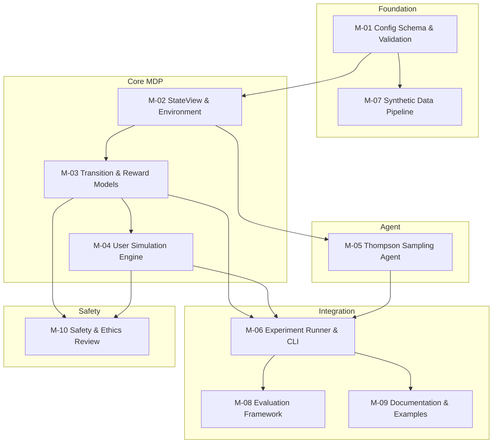

# Roadmap — rl-health-interventions

## Vision Statement

Build a configurable simulation framework where RL-driven health intervention experiments are specified entirely through YAML config files, enabling systematic cross-dataset and cross-policy comparisons without bespoke engineering. The framework ships features as supervisors need them; the longer-term goal is a working CLI that trains agents on synthetic data and produces reproducible results tables, with Nature Methods publication readiness downstream of that.

## Non-Goals (Current Phase)

Parked until the MVP (Issue #101) ships and we have supervisor
feedback on it:

- Multi-timescale reward (immediate + delayed body measure)
- 4 user archetypes (goal-driven, social, resistant, stable)
- Burden accumulation / decay model
- Evaluation framework (bootstrap CIs, power analysis)
- Multi-feature synthetic data matched to population statistics
- Safety / ethics review (pending real data)

These belong in the backlog. They are not "blocked" — they are
intentionally not the current focus.

## Milestone Backlog

Rough guidance, not a release plan. Active work is tracked in
GitHub issues with the `phase-1` label. This table describes the
eventual shape of the framework, not the order it will be built in.

| ID | Name | Description | Prerequisite IDs | Definition of Done |
|----|------|-------------|-----------------|-------------------|
| M-01 | Config Schema & Validation | Implement Pydantic schemas for all config types (DataConfig, MDPConfig, AgentConfig, ExperimentConfig) with 3-layer validation | — | All config types validated from YAML; invalid configs rejected with clear errors; 3-layer validation (schema → registry → dummy step) implemented |
| M-02 | StateView & Environment | Implement StateView dataclass and Environment with step/reset API following MDP formalisation | M-01 | Environment.step(state, action) returns (StateView, float, bool); StateView.from_dataset() works; multi-timescale reward (immediate + 3-week delayed) functional |
| M-03 | Transition & Reward Models | Implement RuleBasedTransition and CompoundReward with configurable parameters | M-02 | Transition model produces state changes based on action + user profile; compound reward computes immediate + delayed components; burden accumulation/decay working |
| M-04 | User Simulation Engine | Implement UserProfile with 4 archetypes and RuleBasedResponse model | M-03 | 4 archetypes (goal-driven, social, resistant, stable) produce distinct response patterns; burden threshold triggers response decay; all parameters configurable |
| M-05 | Thompson Sampling Agent | Implement ThompsonSamplingAgent with configurable priors and action selection | M-02 | Agent.select_action(state) returns valid action; Agent.update() updates posterior; regret decreases on known-optimal bandit problem |
| M-06 | Experiment Runner & CLI | Implement ExperimentFactory, Experiment, and CLI with config-driven execution | M-01, M-03, M-04, M-05 | `uv run rl-health-interventions --config experiment.yml` runs end-to-end; results table output; config snapshot + seeds saved for reproducibility |
| M-07 | Synthetic Data Pipeline | Complete synthetic data generation with realistic wearable data distributions | M-01 | SyntheticDataGenerator produces multi-feature data (steps, HR, sleep) from configurable parameters; statistical properties match published population stats |
| M-08 | Evaluation Framework | Define baselines, metrics, and statistical analysis plan for agent comparison | M-06 | Random/fixed/rule-based baselines implemented; regret/reward/adherence metrics computed; bootstrap CIs for pairwise comparisons; power analysis documented |
| M-09 | Documentation & Examples | Complete API docs, example configs, and contributor guide | M-06 | Sphinx/mkdocs setup; 3 example experiment configs; README quickstart produces working results; architecture diagram present |
| M-10 | Safety & Ethics Review | Add safety constraints, privacy documentation, and ethics considerations | M-03, M-04 | Hard burden thresholds enforced; maximum intervention frequency configurable; GDPR/HIPAA compliance documented; IRB/ethics discussion added to design doc |

## Milestone Detail Cards

### M-01: Config Schema & Validation
**Objective:** Implement complete Pydantic config schema with 3-layer validation pipeline.

**Deliverables:**
- `config/schemas.py` with DataConfig, MDPConfig, ActionSpec, RewardWeights, AgentConfig, ExperimentConfig
- YAML → Pydantic loading pipeline in `config/loader.py`
- 3-layer validation: schema validation → registry lookup → dummy step
- Config validation tests (valid configs pass, invalid configs rejected with clear errors)
- Example config files for synthetic data experiments

**Definition of Done:** All config types can be loaded from YAML files; invalid configs raise ValidationError with actionable messages; 3-layer validation catches wiring errors before experiment starts; `uv run ty check` passes with concrete types.

**Dependencies:** None

**Risks:**
- Risk: Config schema too rigid, preventing extensibility. Mitigation: Use Pydantic's `extra="allow"` for forward compatibility; document extension points.
- Risk: 3-layer validation adds complexity without value. Mitigation: Start with layer 1 (schema); add layers 2-3 only if they catch real errors.

**Nature-publication contribution:** Config-first design is the framework's primary novelty. Reproducible experiments require complete config documentation. This milestone enables the "configurable" claim in the paper.

**Source sub-plan:** subphase_1a_data_layer.md (DataConfig), subphase_1b_mdp_environment.md (MDPConfig, ActionSpec), subphase_1d_agent_library.md (AgentConfig), subphase_1e_experiment_runner.md (ExperimentConfig), code_design.md (3-layer validation)

---

### M-02: StateView & Environment
**Objective:** Implement StateView dataclass and Environment with step/reset API following MDP formalisation.

**Deliverables:**
- `src/rl_health_interventions/environment.py` with Environment class
- `src/rl_health_interventions/state.py` with StateView dataclass
- StateView.from_dataset(dataset, user_idx, t) classmethod
- Environment.step(state, action) → (StateView, float, bool)
- Environment.reset() → StateView
- Multi-timescale reward accumulator (immediate + 3-week delayed)
- Episode termination logic (fixed-length or condition-based)
- Environment tests (step API contract, reward timing, episode boundaries)

**Definition of Done:** Environment.step(state, action) returns correctly typed StateView; reward includes both immediate and delayed components at correct epochs; episode termination works; `uv run pytest` passes for all environment tests.

**Dependencies:** M-01 (config schemas define state variables, actions, reward weights)

**Risks:**
- Risk: StateView design doesn't accommodate all state variables in initial_design.tex. Mitigation: Use dict[str, float] for features; allow extensibility.
- Risk: Multi-timescale reward credit assignment unclear. Mitigation: Start with sparse delayed reward; document decaying alternative as future work.

**Nature-publication contribution:** The MDP environment is the core scientific contribution. Correct implementation of the formalised MDP (states, actions, transitions, rewards) is essential for the paper's methodology section.

**Source sub-plan:** subphase_1b_mdp_environment.md, code_design.md (StateView, Environment interfaces), initial_design.tex §3 (MDP formalisation)

---

### M-03: Transition & Reward Models
**Objective:** Implement RuleBasedTransition and CompoundReward with configurable behavioural response and burden accumulation.

**Deliverables:**
- `transitions/rule_based.py` with RuleBasedTransition implementing behavioural response model
- `rewards/compound.py` with CompoundReward implementing multi-timescale reward
- Burden accumulation/decay logic (linear accumulator with threshold)
- Configurable reward weights (α, β, λ, η) and action penalties
- Transition and reward tests (response direction, burden dynamics, reward components)

**Definition of Done:** Transition model produces state changes based on action + user profile; burden accumulates on intervention and decays on no-action; compound reward computes both immediate and delayed components; all parameters configurable via MDPConfig.

**Dependencies:** M-02 (Environment calls transition and reward models)

**Risks:**
- Risk: Rule-based transition model too simplistic for realistic behaviour. Mitigation: Document limitations; plan data-driven transition model for Phase 2.
- Risk: Burden model parameters uncalibrated. Mitigation: Use published values from StepCountJITAI; document as open question.

**Nature-publication contribution:** The transition and reward models encode the behavioural science hypotheses. The multi-timescale reward (immediate steps + delayed body measure) is a novel contribution that must be validated.

**Source sub-plan:** subphase_1b_mdp_environment.md (TransitionModel, RewardHandler), initial_design.tex §3.2 (Transition), §3.3 (Reward)

---

### M-04: User Simulation Engine
**Objective:** Implement UserProfile with 4 behavioural archetypes and RuleBasedResponse model producing distinct response patterns.

**Deliverables:**
- `simulation/user_profile.py` with UserProfile Pydantic schema
- `simulation/rule_based.py` with RuleBasedResponse implementing archetype-specific responses
- 4 archetypes: goal-driven, social responder, resistant, stable maintainer
- Parameter ranges for each archetype (response magnitude, burden rate, baseline activity)
- Response model tests (each archetype produces expected response direction)

**Definition of Done:** 4 archetypes produce distinct, plausible response patterns; goal-driven responds to reminders, social responds to motivation, resistant shows flat response, stable shows low marginal gain; burden threshold triggers response decay; all parameters configurable.

**Dependencies:** M-03 (Transition model uses response model output)

**Risks:**
- Risk: Archetype parameters not grounded in clinical literature. Mitigation: Cite StepCountJITAI and HeartSteps for parameter ranges; document as calibration target for Phase 2.
- Risk: Archetypes too discrete; real users are heterogeneous. Mitigation: Document as limitation; plan continuous parameter sampling for Phase 2.

**Nature-publication contribution:** User archetypes enable systematic evaluation across population segments. The 4-archetype model is a simplification that must be validated against real data in Phase 2.

**Source sub-plan:** subphase_1c_user_simulation.md, initial_design.tex §3.2 (4 archetypes)

---

### M-05: Thompson Sampling Agent
**Objective:** Implement ThompsonSamplingAgent with configurable priors and action selection for contextual bandits.

**Deliverables:**
- `agents/thompson_sampling.py` with ThompsonSamplingAgent implementing full TS algorithm
- Gaussian Thompson Sampling with known variance (or Beta TS for binary rewards)
- Configurable prior parameters and exploration rate
- Agent tests (action selection, posterior updates, regret decrease on bandit problem)

**Definition of Done:** Agent.select_action(state) returns valid action based on posterior sampling; Agent.update() updates posterior correctly; regret decreases over time on known-optimal bandit; hyperparameters configurable via AgentConfig.

**Dependencies:** M-02 (Agent interface requires StateView)

**Risks:**
- Risk: Thompson Sampling underperforms for large state spaces. Mitigation: Start with tabular TS; document contextual TS as future work.
- Risk: Prior specification sensitive. Mitigation: Provide default priors from literature; allow config override.

**Nature-publication contribution:** Thompson Sampling is the confirmed baseline agent. Correct implementation is essential for comparison with future deep RL agents (DQN, PPO) planned as stretch goals.

**Source sub-plan:** subphase_1d_agent_library.md, initial_design.tex §4 (Agent module)

---

### M-06: Experiment Runner & CLI
**Objective:** Implement ExperimentFactory, Experiment, and CLI with config-driven end-to-end execution.

**Deliverables:**
- `experiment/factory.py` with ExperimentFactory.build(config) → Experiment
- `experiment/runner.py` with Experiment.run() → ExperimentResult
- `__main__.py` updated with CLI argument parsing (--config flag)
- ExperimentResult with config snapshot, agent results, seeds
- Results output: console table + CSV/JSON files
- Reproducibility: seed management, config snapshot saved with results
- Integration tests (end-to-end experiment runs, results match expected)

**Definition of Done:** `uv run rl-health-interventions --config experiments/demo.yml` runs end-to-end; results table shows agent performance metrics; config snapshot and seeds saved in results/ directory; same config + seed produces identical results across 2 runs.

**Dependencies:** M-01 (config schemas), M-03 (transition/reward), M-04 (user simulation), M-05 (agent)

**Risks:**
- Risk: Experiment loop too slow for large-scale experiments. Mitigation: Profile early; use numpy vectorisation where possible.
- Risk: Results format not suitable for analysis. Mitigation: Output both human-readable (console table) and machine-readable (CSV/JSON) formats.

**Nature-publication contribution:** The experiment runner enables reproducible experiments, which is a core requirement for Nature Methods submission. Config-driven execution demonstrates the framework's value proposition.

**Source sub-plan:** subphase_1e_experiment_runner.md, code_design.md (ExperimentFactory, Experiment)

---

### M-07: Synthetic Data Pipeline
**Objective:** Complete synthetic data generation with realistic wearable data distributions parameterised from published population statistics.

**Deliverables:**
- `data/synthetic.py` updated with multi-feature generation (steps, HR, sleep, sedentary time)
- Population statistics from NHANES, All of Us, UK Biobank documented in config
- Distribution parameters (mean, variance, correlations) configurable
- Synthetic data validation tests (non-negative steps, realistic ranges, no NaNs)
- Example synthetic dataset for testing

**Definition of Done:** SyntheticDataGenerator produces multi-feature data with statistical properties matching published population stats; step counts non-negative; heart rate in physiological range; sleep hours realistic; all parameters configurable via DataConfig.

**Dependencies:** M-01 (DataConfig defines generation parameters)

**Risks:**
- Risk: Synthetic data too simplistic; doesn't capture temporal correlations. Mitigation: Start with i.i.d. sampling; document as limitation; plan time-series generation for Phase 2.
- Risk: Population statistics not representative. Mitigation: Cite sources; document demographic coverage; plan stratified sampling for Phase 2.

**Nature-publication contribution:** Synthetic data enables pipeline development and agent benchmarking before real data access. The generation parameters must be documented for reproducibility.

**Source sub-plan:** subphase_1a_data_layer.md (SyntheticDataGenerator), initial_design.tex §5 (Data Sources)

---

### M-08: Evaluation Framework
**Objective:** Define and implement baselines, metrics, and statistical analysis plan for rigorous agent comparison.

**Deliverables:**
- Baseline agents: random policy, fixed policy, rule-based policy
- Metrics: cumulative regret, average reward, adherence rate, sustained behaviour change
- Statistical analysis: bootstrap CIs for pairwise comparisons, effect sizes
- Power analysis document (sample size justification)
- Evaluation tests (baselines produce expected performance, metrics computed correctly)

**Definition of Done:** 3+ baselines implemented; all metrics computed for each agent; bootstrap CIs for pairwise comparisons; power analysis documents minimum detectable effect size; statistical tests appropriate for multiple comparisons.

**Dependencies:** M-06 (experiment runner executes evaluations)

**Risks:**
- Risk: Baselines too weak; RL agent appears better than it is. Mitigation: Include strong rule-based baselines from literature.
- Risk: Statistical tests inappropriate for non-normal rewards. Mitigation: Use non-parametric tests (bootstrap, permutation) where appropriate.

**Nature-publication contribution:** Rigorous evaluation is essential for Nature Methods. The evaluation framework must meet statistical reporting standards (pre-specified analysis, effect sizes, confidence intervals).

**Source sub-plan:** Derived from Phase 1 gap analysis (no evaluation methodology in design doc)

---

### M-09: Documentation & Examples
**Objective:** Complete API documentation, example configs, and contributor guide to enable external use.

**Deliverables:**
- Sphinx or mkdocs setup with auto-generated API docs from docstrings
- 3 example experiment configs: synthetic_baseline.yml, multi_agent_comparison.yml, sensitivity_analysis.yml
- README updated with architecture diagram, usage examples, and working quickstart
- CONTRIBUTING.md updated with API documentation guide
- CHANGELOG.md created with versioning strategy

**Definition of Done:** API docs cover all public classes and functions; 3 example configs demonstrate different use cases; README quickstart runs a working experiment; architecture diagram shows data flow; new contributor can understand system from docs alone.

**Dependencies:** M-06 (experiment runner must work for examples to be meaningful)

**Risks:**
- Risk: Documentation becomes stale as code evolves. Mitigation: Add docstring checks to CI; require docstrings for public APIs.
- Risk: Example configs too complex for beginners. Mitigation: Start with minimal example; add advanced examples progressively.

**Nature-publication contribution:** Complete documentation enables reproducibility, which is a Nature requirement. Example configs demonstrate the framework's usability.

**Source sub-plan:** Derived from Phase 2 doc-alignment audit (missing docs identified)

---

### M-10: Safety & Ethics Review
**Objective:** Add safety constraints, privacy documentation, and ethics considerations for health intervention system.

**Deliverables:**
- Hard safety constraints: maximum intervention frequency, minimum recovery periods, burden threshold limits
- Safety violation logging and reporting
- Privacy documentation: GDPR/HIPAA compliance strategy, data anonymisation procedures
- Ethics section in initial_design.tex: IRB/ethics discussion, consent tracking, data use agreements
- Safety tests (constraints enforced, violations logged)

**Definition of Done:** Hard safety constraints configurable and enforced; safety violations logged with timestamps; privacy documentation covers all Phase 2 datasets; ethics section added to design doc; IRB/ethics approval status documented for real data use.

**Dependencies:** M-03 (transition/reward models), M-04 (user simulation with burden)

**Risks:**
- Risk: Safety constraints too restrictive; limit agent performance. Mitigation: Make constraints configurable; document trade-offs.
- Risk: Privacy documentation incomplete for Phase 2 datasets. Mitigation: Consult with data providers early; document data use agreements.

**Nature-publication contribution:** Health interventions require explicit safety and ethics discussion. Nature Methods requires ethical approval documentation for any human-subjects research, even simulated.

**Source sub-plan:** Derived from Phase 1 gap analysis (no safety/ethics in design doc)

## Critical Path

## Success Metrics

### Foundation (M-01, M-07)
- **M-01:** 100% of config types validated from YAML; 3-layer validation catches ≥5 real wiring errors in test suite
- **M-07:** Synthetic data statistical properties within 10% of published population statistics for steps, HR, sleep

### Core MDP (M-02, M-03, M-04)
- **M-02:** Environment.step(state, action) executes in <1ms per step; multi-timescale reward correct at 21-day boundaries
- **M-03:** Transition model produces ≥3 distinct response patterns; burden accumulation/decay matches StepCountJITAI formulation
- **M-04:** 4 archetypes produce statistically distinct response distributions (p<0.01, ANOVA)

### Agent (M-05)
- **M-05:** Thompson Sampling regret decreases ≥20% over 1000 episodes on bandit problem; action selection matches theoretical distribution

### Integration (M-06, M-08, M-09)
- **M-06:** End-to-end experiment completes in <5 minutes for 100 users × 90 days; reproducibility: identical results across 2 runs with same seed
- **M-08:** ≥3 baselines implemented; statistical power ≥80% for detecting 10% improvement over best baseline
- **M-09:** API docs cover 100% of public APIs; 3 example configs tested and working; README quickstart produces results in <2 minutes

### Safety (M-10)
- **M-10:** 100% of safety constraints enforced; zero safety violations in test suite; privacy documentation covers all 3 Phase 2 datasets

### Overall Success Criteria
- **Publication readiness:** All Nature Methods statistical reporting requirements met (pre-specified analysis, effect sizes, CIs)
- **Framework usability:** External researcher can configure and run experiment using only documentation
- **Reproducibility:** Same config + seed produces identical results on different machines
- **Performance:** Thompson Sampling outperforms random baseline by ≥15% cumulative reward on synthetic data
