# Technical Dependencies, Risk Register, TRL, and Stub Tracker

Generated: 2026-06-11 (updated 2026-06-17 post-PR #103)
Sources: `docs/initial_design.tex`, `docs/ROADMAP.md`, `reports/phase1_design_analysis.md`, `src/` sources, `config/` sources, `pyproject.toml`

---

## Technical Dependency Graph

```mermaid
flowchart TD

    %% ===== CONFIG LAYER =====
    subgraph Config["Config Layer"]
        SCHEMA["config/schemas.py\n— MDPConfig, AgentConfig,\nTransitionModelConfig\n— Pydantic models\nIMPLEMENTED: PR #103"]
        LOADER["config/loader.py\n— YAML → Pydantic\n— schema + cross-ref validation\nIMPLEMENTED: PR #103"]
        DCONF["config/datasets/*.yaml\n— 14 dataset configs\n14 configs exist"]
    end

    %% ===== DATA LAYER =====
    subgraph Data["Data Layer (src/data/)"]
        BASE["_base.py\n— DataConfig (Pydantic)\n— DatasetProtocol"]
        DSET["dataset.py\n— Dataset dataclass"]
        POLARS["polars_reader.py\n— scan_csv/parquet\nwith timeout"]
        LOADERS["loaders.py\n— 12 dataset loaders\n— get_all_loaders()\n— load_all()"]
        SYNT["synthetic.py\n— SyntheticDataGenerator\n(only steps, stub)"]
        FEAT["feature_pipeline.py\n— FeaturePipeline.stub"]
        DATAINIT["__init__.py\n— Registry + make()"]
    end

    %% ===== MDP / CORE LAYER =====
    subgraph Core["Core MDP Layer"]
        STATE["state.py (StateView)\n— activity, day, step_of_day\n— frozen dataclass\nIMPLEMENTED: PR #103"]
        ENV["environment.py\n— Environment step/reset\n— uses registry factories\nIMPLEMENTED: PR #103"]
    end

    %% ===== TRANSITION & REWARD =====
    subgraph TR["Transition & Reward"]
        TINIT["transitions/__init__.py\n— Registry + make()"]
        TBASE["transitions/_base.py\n— TransitionModel ABC"]
        TRULE["transitions/rule_based.py\n— RuleBasedTransition\n— config-driven probability matrix\nIMPLEMENTED: PR #103"]

        RINIT["rewards/__init__.py\n— Registry + make()"]
        RBASE["rewards/_base.py\n— RewardHandler ABC"]
        RCOMP["rewards/compound.py\n— CompoundReward\n— precomputed per-step reward\nIMPLEMENTED: PR #103"]
    end

    %% ===== USER SIMULATION =====
    subgraph Sim["User Simulation"]
        SINIT["simulation/__init__.py\n— Registry + make()"]
        SBASE["simulation/_base.py\n— ResponseModel ABC"]
        SRULE["simulation/rule_based.py\n— RuleBasedResponse\nSTUB: returns 0.0"]
        UPROF["simulation/user_profile.py\n— UserProfile with 4 archetypes\nMISSING: not yet implemented"]
    end

    %% ===== AGENT =====
    subgraph Agent["Agent"]
        AINIT["agents/__init__.py\n— Registry + make()"]
        ABASE["agents/_base.py\n— Agent ABC"]
        ATS["agents/thompson_sampling.py\n— Beta-Bernoulli posterior\nIMPLEMENTED: PR #103"]
        EGRE["agents/epsilon_greedy.py\n— Q-learning incremental avg\nIMPLEMENTED: PR #103"]
        UCB1["agents/ucb.py\n— Upper Confidence Bound\nIMPLEMENTED: PR #103"]
        RAND["agents/random.py\n— Uniform random selection\nIMPLEMENTED: PR #103"]
    end

    %% ===== EXPERIMENT =====
    subgraph Exp["Experiment Runner"]
        EXPF["experiment.py\n— run_episode(), run_experiment()\n— CSV output, agent iteration\nIMPLEMENTED: PR #103"]
        MAIN["__main__.py\n— CLI entry point\n— --config, --agent, --output, --seed\nIMPLEMENTED: PR #103"]
        RGRS["tests/test_regression_mvp.py\n— JSON fixture at seed 42\n— 6dp exact match\nIMPLEMENTED: PR #103"]
    end

    %% ===== EVALUATION =====
    subgraph Eval["Evaluation (missing)"]
        EVALM["MISSING:\n— Baselines (random, fixed,\n  rule-based)\n— Metrics computation\n— Statistical analysis"]
    end

    %% ===== SAFETY =====
    subgraph Safe["Safety (missing)"]
        SAFEM["MISSING:\n— Hard burden thresholds\n— Intervention frequency limits\n— Safety violation logging\n— Privacy documentation"]
    end

    %% ===== DEPENDENCY EDGES =====
    %% Config depends on pydantic
    SCHEMA --> PYD
    LOADER --> SCHEMA
    LOADER --> PYD
    DCONF -.-> LOADER

    %% Data layer
    BASE --> PYD
    DSET --> NP
    POLARS --> PD
    POLARS --> REQ
    LOADERS --> POLARS
    LOADERS --> KG
    LOADERS --> DS
    LOADERS --> HF
    LOADERS --> PND
    LOADERS --> UCI
    LOADERS --> WF
    LOADERS --> REQ
    SYNT --> NP
    SYNT --> DSET
    FEAT -.-> DSET

    %% Core MDP
    STATE --> SCHEMA
    ENV --> STATE
    ENV --> SCHEMA

    %% Transitions & Rewards
    TRULE --> TBASE
    TRULE --> SCHEMA
    RCOMP --> RBASE
    RCOMP --> SCHEMA
    TBASE --> SCHEMA
    RBASE --> SCHEMA

    %% User Simulation
    SRULE --> SBASE
    SRULE --> SCHEMA
    UPROF --> SCHEMA
    SBASE --> SCHEMA

    %% Agent
    ATS --> ABASE
    EGRE --> ABASE
    UCB1 --> ABASE
    RAND --> ABASE
    ABASE --> SCHEMA

    %% Experiment runner
    EXPF --> SCHEMA
    EXPF --> ENV
    MAIN --> EXPF

    %% Evaluation depends on experiment
    EVALM --> EXPF

    %% Safety depends on transition + simulation
    SAFEM --> ENV
    SAFEM --> UPROF
```

### External Dependencies

| Package | Purpose |
|---------|---------|
| numpy | Numerical operations, array processing |
| polars | Fast CSV/Parquet data reading |
| pydantic | Config schema validation |
| datasets (HF) | HuggingFace dataset access |
| huggingface-hub | Model/dataset hub integration |
| kagglehub | Kaggle dataset download |
| pandas | Data manipulation (secondary) |
| ucimlrepo | UCI ML Repository access |
| wfdb | WFDB signal data (physiological) |
| requests | HTTP requests for data retrieval |
| Python >=3.11 | Runtime requirement |

---

## Risk Register

| Risk ID | Description | Affected Milestone(s) | Likelihood (H/M/L) | Impact (H/M/L) | Mitigation Strategy |
|---------|-------------|----------------------|-------------------|----------------|---------------------|
| R-01 | **Reward hacking** — Agent learns to maximise short-term step rewards by sending interventions every epoch, ignoring burden penalty if α ≫ β. Burden mechanism becomes ineffective. | M-03, M-05, M-06 | H | H | Implement explicit counterweight in compound reward (penalty scaling with intervention frequency); add reward normalisation; include reward-shaping tests that verify burden-sensitive behaviour; document reward weight sensitivity analysis. |
| R-02 | **Distribution shift (sim-to-real gap)** — Rule-based synthetic transitions produce unrealistic trajectories. Agent policies trained on synthetic data fail to transfer to real user behaviour in Phase 2. | M-03, M-04, M-06, M-08 | H | H | Document domain randomisation strategy for Phase 1 parameters; plan calibration against HeartSteps response data in Phase 2; implement robustness evaluation by perturbing transition parameters ±20%; add distributional shift metrics (DKL between synthetic/held-out distributions). |
| R-03 | **Safety violations** — No hard safety constraints implemented. Agent could select high-burden interventions repeatedly, causing simulated user burnout or producing clinically unsafe policies when transferred. | M-04, M-10 | H | H | Implement hard burden thresholds (B_max) in Environment.step() that reject actions exceeding threshold; add minimum recovery periods between non-zero interventions; enforce configurable max interventions-per-day; log and surface all safety violations in experiment output. |
| R-04 | **Data leakage across user profiles** — User identification vectors or combined state representations may leak information between synthetic user trajectories, biasing agent evaluation. | M-02, M-05, M-06 | M | M | Ensure per-user data separation in Dataset and StateView; add per-user random seeds in simulation; verify that agent update is strictly per-trajectory; document data isolation design in experiment runner. |
| R-05 | **Clinical validity failures** — Reward weights (α, β, λ, η) and archetype parameters are not clinically grounded. Agent may optimise proxies that don't correspond to meaningful health outcomes. | M-03, M-04, M-08 | H | H | Document all parameter sources with citations from StepCountJITAI and HeartSteps literature; plan sensitivity analysis across parameter space; add clinical metrics (sustained behaviour change, intervention fatigue) beyond ML metrics; define minimum clinically meaningful effect size before Phase 2. |
| R-06 | **Config schema rigidity** — Pydantic models for DataConfig, MDPConfig, AgentConfig, ExperimentConfig become too rigid to support future extensions (new action types, observation functions, custom reward shapes). | M-01 | M | M | Use Pydantic's `extra="allow"` for forward compatibility; document extension points in schema; define a version field for config evolution; add integration tests that verify unknown fields don't crash config loading. |
| R-07 | **Multi-timescale reward credit assignment failure** — The sparse 3-week delayed body measure reward is too distant from the actions that produced it. Agent fails to learn long-term behaviour change strategies. | M-02, M-03, M-05 | M | H | Implement both sparse and decaying delayed reward formulations (configurable); add eligibility trace diagnostics; verify that Thompson Sampling posterior update captures delayed effects; document decaying reward as recommended alternative in user-facing docs. |
| R-08 | **Missing datasets block Phase 2 validation** — Access to All of Us (controlled tier, 4-8 week application) and HeartSteps data (requires author permission) may be delayed or denied, preventing MDP calibration. | M-06, M-08, M-09 | H | H | Begin data access applications as early as possible (Week 1); maintain synthetic-only validation pipeline as fallback; document data access status in README; plan calibration against published summary statistics if raw data is unavailable. |
| R-09 | **User archetype discretisation fails to capture heterogeneity** — Four discrete archetypes (goal-driven, social, resistant, stable) cannot span the real population distribution, making simulator evaluations misleading. | M-04 | M | H | Document discrete archetypes as a known limitation; plan continuous-parameter sampling for Phase 2; validate archetype separation with ANOVA tests (success metric: p<0.01); add mixture-of-archetypes capability as stretch goal. |
| R-10 | **Partial observability unaddressed** — The MDP assumes full state observability but real wearable data has missing sensor readings, measurement noise, and reporting delays, invalidating MDP assumptions for real-data runs. | M-02, M-03, M-06 | M | H | Frame as POMDP from the start with an observation function O(o|s) in Environment; add missing-data masks to StateView; implement observation noise injection in synthetic pipeline; document POMDP vs MDP assumptions in design doc. |
| R-11 | **Evaluation metrics insufficient for publication** — Only regret/reward metrics computed without clinical validation, statistical confidence intervals, or comparison baselines, failing Nature Methods requirements. | M-08 | H | H | Implement ≥3 baselines (random, fixed, rule-based) as blocking criterion for M-08; compute bootstrap CIs for all pairwise comparisons; add pre-registered analysis plan documented in repo; include effect sizes and power analysis. |
| R-12 | **Experiment runner performance bottleneck** — Single-threaded experiment loop with 100 users × 90 days × multiple agents may take >1 hour, hindering iterative development and large-scale parameter sweeps. | M-06 | M | M | Profile experiment loop early in development; use NumPy vectorisation for batch operations; implement optional multi-user parallelisation with `concurrent.futures`; target <5 min for 100 users × 90 days. |
| R-13 | **Dependency version conflicts** — The dependency set (numpy, polars, pandas, pydantic, datasets, kagglehub, ucimlrepo, wfdb) may have conflicting constraints as packages evolve. | M-01, M-06, M-07 | L | M | Pin exact versions in `uv.lock`; run CI with `uv sync --frozen` daily; add dependency conflict check to CI pipeline; upgrade one dependency at a time with full test suite run. |

---

## Technology Readiness Levels (TRL)

TRL definitions (adapted for computational research):  
1 — Basic principles observed / concept formulated  
2 — Technology concept / architecture specified  
3 — Analytical/experimental proof of concept  
4 — Component validated in laboratory (unit tests pass)  
5 — Component validated in relevant environment (integration tests pass)  
6 — System demonstrated in relevant environment (end-to-end runs)  
7 — System demonstrated in operational environment  
8 — System complete and qualified  
9 — Actual system proven in operational environment  

| Component | Current TRL | Target TRL | Gap Description | Blocking Milestone |
|-----------|-------------|------------|-----------------|-------------------|
| **Config Schema & Validation** (`config/schemas.py`, `config/loader.py`) | 5 | 7 | MDPConfig, AgentConfig, TransitionModelConfig, TransitionProbabilities implemented with cross-reference validators. Schema-reference mode stub. Missing: ExperimentConfig, ActionSpec, DataConfig, 3-layer validation. | M-01 ✅ |
| **StateView & Environment** (`src/rl_health_interventions/state.py`, `environment.py`) | 5 | 7 | StateView dataclass (activity, day, step_of_day, steps_per_day) and Environment step/reset implemented. Uses registry factories. Missing: `from_dataset()`, multi-timescale reward, safety constraints. | M-02 ✅ |
| **Transition Models** (`transitions/`) | 5 | 7 | RuleBasedTransition implements config-driven probability matrix with seeded RNG. Missing: burden accumulation, behaviour response model, archetype parameterisation. | M-03 ✅ |
| **Reward Models** (`rewards/`) | 5 | 7 | CompoundReward uses precomputed per-step reward array. Missing: multi-timescale reward, configurable weights, action penalties. | M-03 ✅ |
| **User Simulation** (`simulation/`) | 2 | 7 | ResponseModel ABC exists with abstract `response()`. RuleBasedResponse returns 0.0 — no archetype logic, no UserProfile class, no parameter ranges for 4 archetypes. | M-04 |
| **Agent Library** (`agents/`) | 5 | 7 | Thompson Sampling (Beta-Bernoulli), epsilon-greedy (Q-learning incremental average), UCB, and Random all implemented. Missing: state-conditioned agents, deep RL. | M-05 ✅ |
| **Experiment Runner & CLI** (`experiment.py`, `__main__.py`) | 5 | 7 | `run_episode()` and `run_experiment()` implemented. CLI with `--config`, `--agent`, `--output`, `--seed`. Regression test with JSON fixture. Missing: multi-user parallelisation, config snapshot, results/ directory. | M-06 ✅ |
| **Synthetic Data Pipeline** (`data/synthetic.py`) | 3 | 6 | SyntheticDataGenerator exists and produces Dataset objects with steps, but only uses univariate normal — no multi-feature generation (HR, sleep, sedentary), no configurable distribution parameters, no temporal correlations. FeaturePipeline is a stub. | M-07 |
| **Data Loaders** (`data/loaders.py`) | 5 | 6 | 12 dataset loaders implemented with download, caching, error handling, and standardised output. Missing: `allofus_fitbit` loader (BigQuery, requires AoU workbench access), `stepcountjitai` loader (no code integration yet). Bulk `load_all()` works. | M-07 |
| **Evaluation Framework** (not yet created) | 1 | 6 | No baselines (random, fixed, rule-based). No metrics computation (regret, reward, adherence). No statistical analysis (bootstrap CIs, effect sizes, power analysis). No evaluation module exists. | M-08 |
| **Documentation & Examples** (`docs/`, `README.md`) | 4 | 7 | Design doc exists (.tex) and is comprehensive. Architecture sub-plans exist. README has working quickstart and results. Missing: architecture diagram, API docs, example configs for actual experiments. | M-09 |
| **Safety & Ethics** (not yet created) | 1 | 6 | No hard safety constraints in any component. No burden threshold enforcement. No privacy documentation. No ethics review or IRB discussion. Maximum intervention frequency not configurable. | M-10 |

---

## Stub-to-Implementation Tracker

| Stub File | What It Must Implement | Test Criteria | Blocking Milestone ID |
|-----------|-----------------------|---------------|----------------------|
| `src/rl_health_interventions/data/synthetic.py` — `SyntheticDataGenerator.generate()` | Generate multi-feature synthetic wearable data (steps, HR, sleep hours, sedentary minutes) with configurable distribution parameters (mean, variance, correlations). Support NHANES-calibrated population statistics. Include temporal correlation across timesteps. | • Output `Dataset` object validates successfully • Step counts non-negative, HR in [30,220], sleep hours in [0,24] • Feature means within 10% of configured population parameters over 1000 samples • No NaN/Inf values • Seeded reproducibility (same seed → identical data) | M-07 |
| `src/rl_health_interventions/data/feature_pipeline.py` — `FeaturePipeline.from_config()` | Parse config dict to build transformation chain: column selection → normalisation → feature engineering (time-of-day encoding, day-of-week encoding, rolling averages). Support composable transforms registered via the ABC+registry pattern. | • Pipeline produces correct output shapes per transform • Normalisation maps to [0,1] range • Config validation rejects invalid transforms with clear error • Empty config produces identity pipeline | M-07 |
| `src/rl_health_interventions/simulation/rule_based.py` — `RuleBasedResponse.response()` | Implement archetype-specific response magnitude given (state, action, profile). 4 archetypes: goal-driven (responds to reminders/feedback), social responder (responds to motivational prompts), resistant (low response, fast burden accumulation), stable maintainer (already active, low marginal gain). Return response magnitude. | • Goal-driven: response to a₂ (walking suggestion) and a₃ (goal reminder) > response to a₁ • Social: response to a₁ (motivational prompt) > response to a₂/a₃ • Resistant: overall response magnitude < 30% of other archetypes; burden saturates 2× faster • Stable maintainer: high baseline, low marginal gain from any action • All response values in [0, 1] | M-04 |
| Not yet created — must implement `simulation/user_profile.py`: `UserProfile` | Pydantic schema with fields: archetype (Literal enum), baseline_activity (low/med/high), response_params (dict of action→response params), burden_params (decay rate, max threshold). Factory method to instantiate pre-defined archetype profiles. | • 4 pre-defined archetype profiles produce correct parameter sets • Serialisation round-trips via JSON • Validation rejects invalid archetype names with clear error • All parameters have sensible defaults documented | M-04 |
| Not yet created — must implement `experiment/factory.py`: `ExperimentFactory` | Build experiment components from config: instantiate Dataset from DataConfig, Environment from MDPConfig, Agent from AgentConfig, UserProfiles from profile config. Wire them into Experiment loop. Validate component compatibility (dummy step). | • Build succeeds for valid config • Build fails with clear error for incompatible components (e.g., agent expects different state space) • Registry lookup works for all registered components • Dummy step catches wiring errors before full run | M-06 |
| Not yet created — must implement `experiment/runner.py`: `Experiment` | Run trial loop for N users × T timesteps: for each user, reset Environment, loop: agent selects action → environment steps → reward computed → agent updates. Accumulate metrics per user/per epoch. Return ExperimentResult with config snapshot, seeds, metrics. | • Experiment completes without errors for valid config • Per-user metrics computed (cumulative reward, adherence, regret) • Config snapshot saved in results directory • Random seeds produce deterministic results • Multi-user simulation correctly isolates user trajectories | M-06 |

**Note on implemented components:** The following components were stubs in the original audit but are now implemented in PR #103: `config/schemas.py`, `config/loader.py`, `state.py`, `environment.py`, `transitions/rule_based.py`, `rewards/compound.py`, `agents/thompson_sampling.py`, `agents/epsilon_greedy.py`, `agents/ucb.py`, `agents/random.py`, `__main__.py`, `experiment.py`. The test suite now includes functional tests (regression, validator, unit tests per component).
